# 学校宿舍管理系统

### 使用不同技术栈的相同项目 ：[java+Servlet+JSP+MySQL宿舍管理系统](https://github.com/34426/dormitory-management-system)

### 有问题，或者需要协助调试运行项目的, 可以加QQ：2529519551，或者微信 ：xzxj0206 注明项目，“git+项目名称” ，如：“git学生宿舍管理系统”

### 更多项目： https://github.com/34426?tab=repositories

## 一、介绍

springboot+vue宿舍管理系统

## 二、软件架构

1.  前端：Vue3、Element-Plus、Axios、ECharts、wangEditor

2.  后端：SpringBoot、Mybatis-Plus

## 三、系统运行界面

### 1、前端

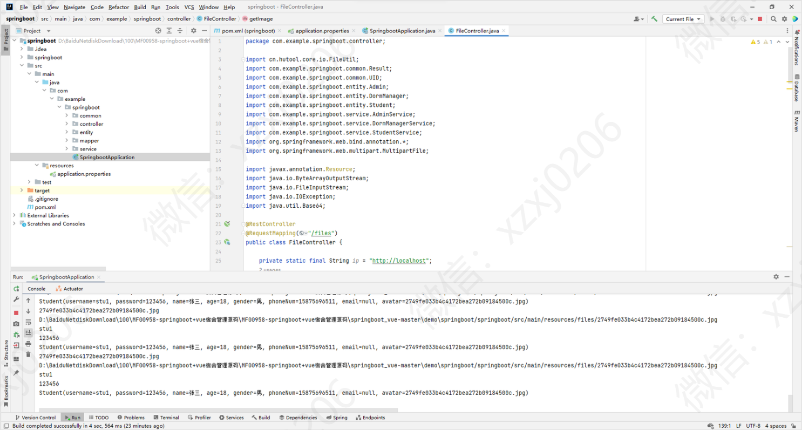

### 2、后端

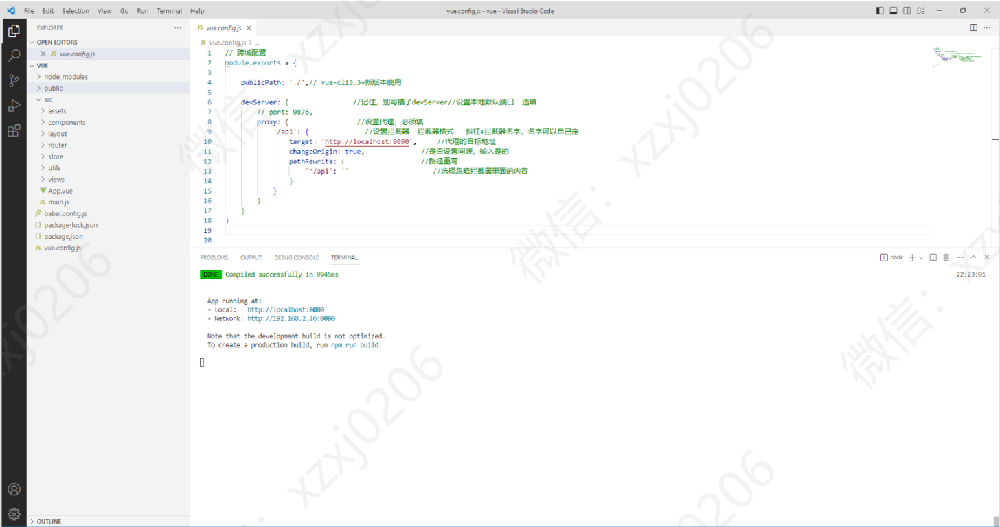

## 四、系统功能

### 1、系统管理员模块部分功能页面展示

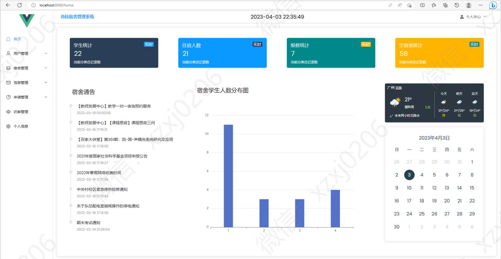

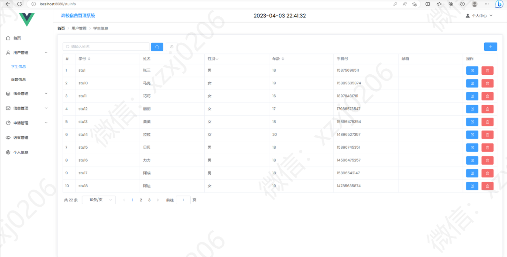

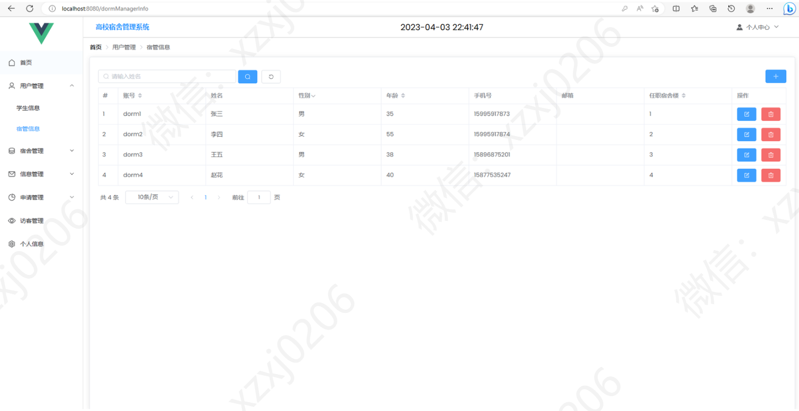

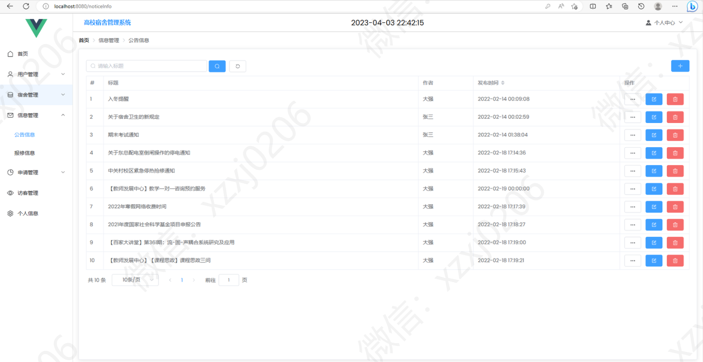

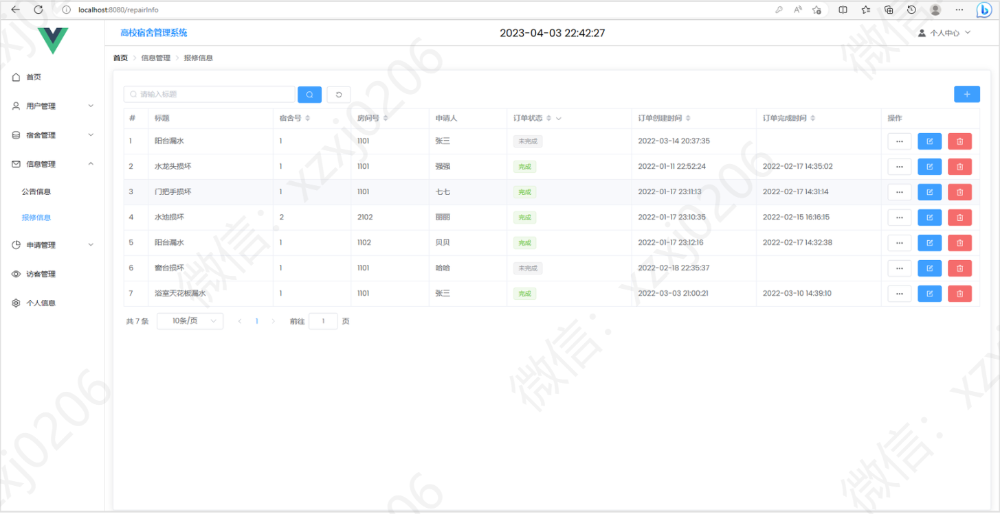

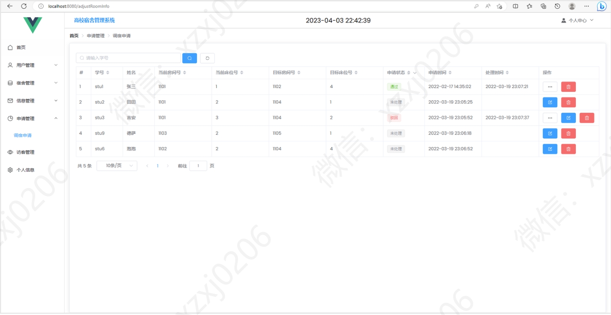

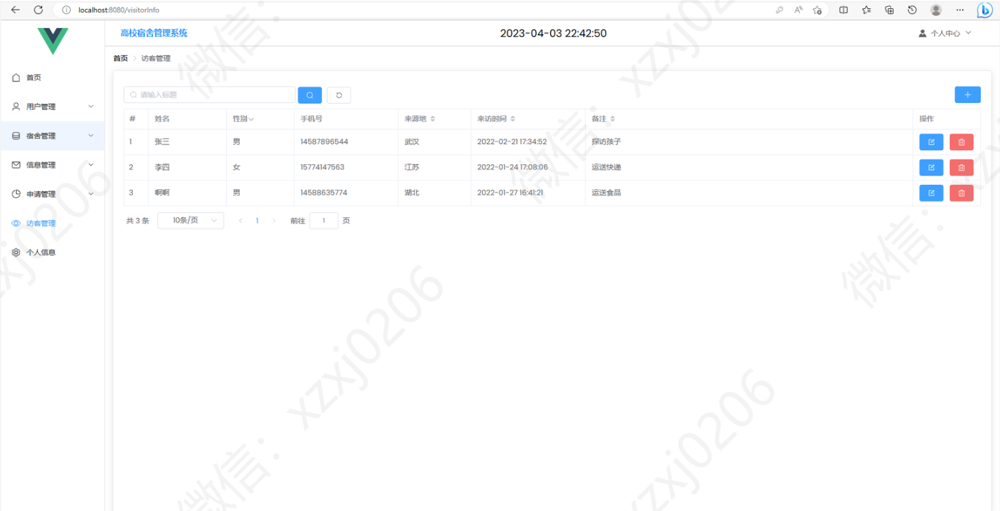

### 2、宿舍管理员模块部分功能页面展示

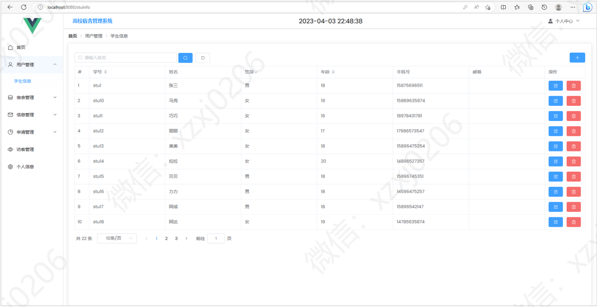

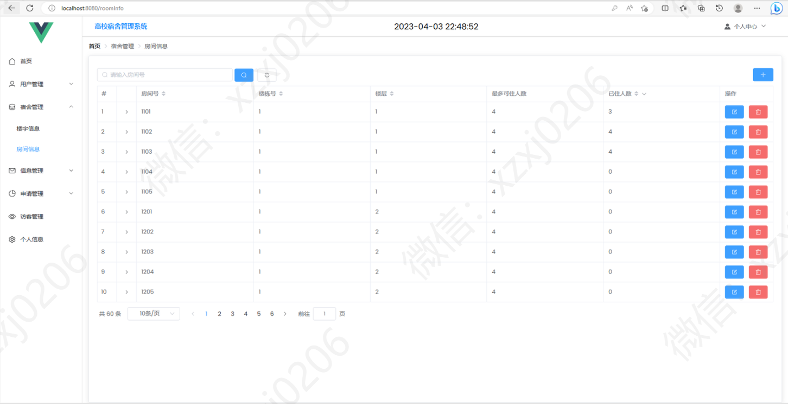

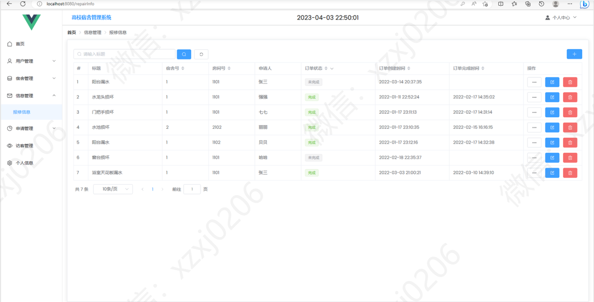

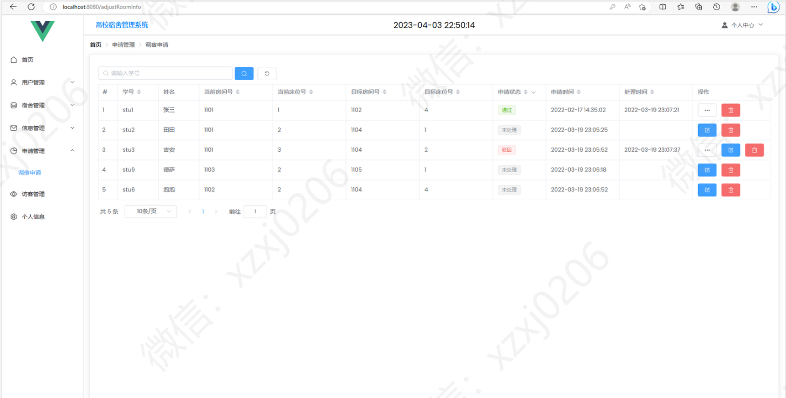

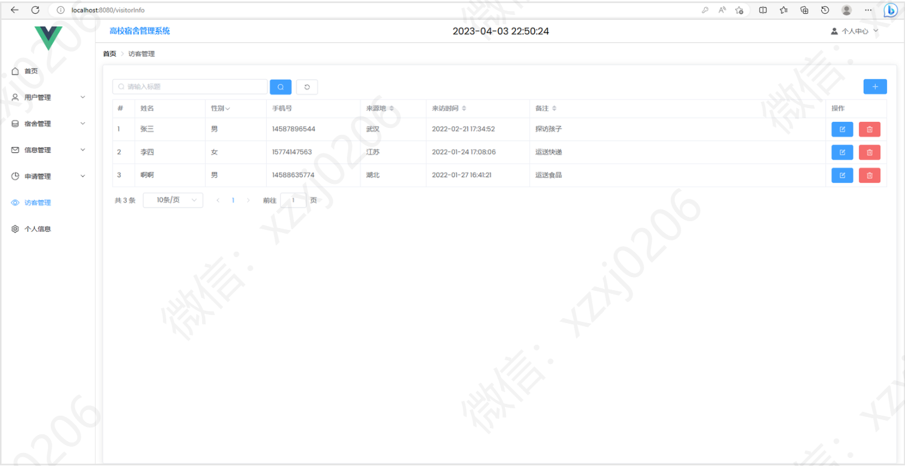

### 3、学生模块部分功能页面展示

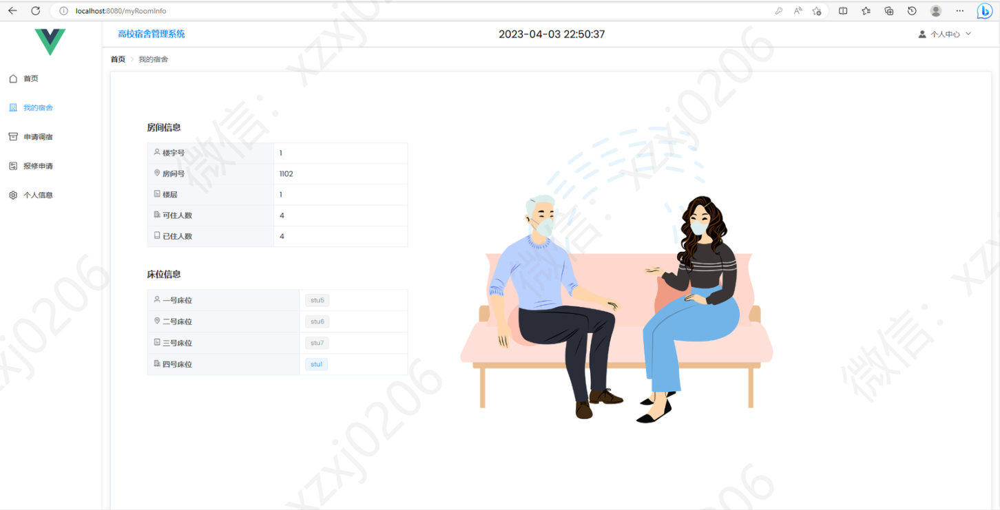

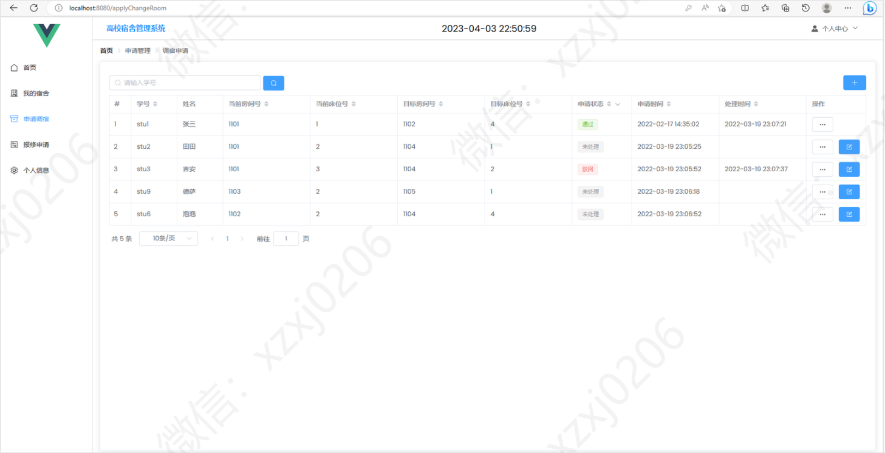

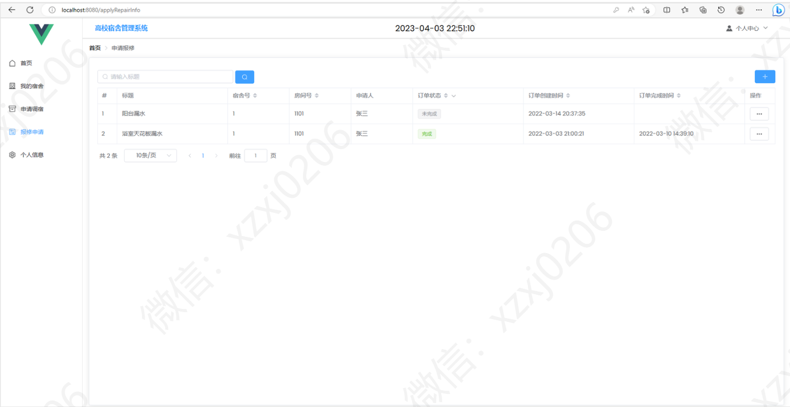

